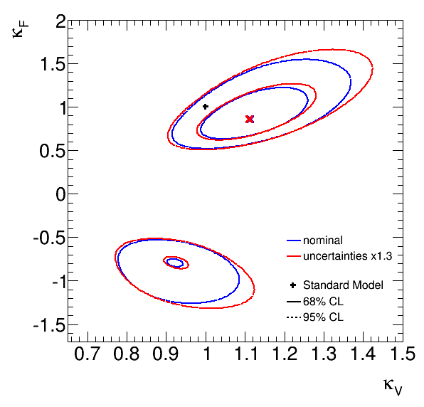
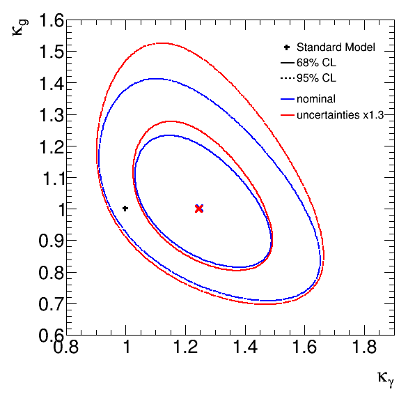

# Decoupled Demo

This demo repository shows a minimal example of how to use _recouple_ on a _decoupled_ model. Please refer to the documentation shown at the main [decouple repository](https://github.com/svenkreiss/decouple) and the paper [arXiv:1401.0080 \[hep-ph\]](http://arxiv.org/abs/1401.0080) for more information about `decouple` and `recouple`. 

For this demo, effective likelihoods and template parametrizations are hosted on this project's [github page](http://svenkreiss.github.com/decoupledDemo). You need to have a version of ROOT with PyROOT. Create a `virtualenv` (which usually comes with your python environment or can be insalled), install the requirements and run `make`:

```
virtualenv venv
source venv/bin/activate
pip install -r requirements.txt

make
```

`make` downloads the decoupled files from the web, runs `recouple` and creates plots.





# Setup environment on CERN's lxplus service

__Before__ running the above commands, you need ROOT with PyROOT. If you can `import ROOT` in python without error then you are already set. If not ...

From the [ROOT website](http://root.cern.ch/drupal/content/production-version-534) (they are slightly outdated: you need SLC6 versions and not SLC5 and a python version that matches the python version ROOT was built with), the instructions for `bash` are (last tested January 2014):

```
# for PyROOT, setup Python environment first
export PATH="/afs/cern.ch/sw/lcg/external/Python/2.7.3/x86_64-slc6-gcc47-opt/bin:$PATH"
export LD_LIBRARY_PATH="/afs/cern.ch/sw/lcg/external/Python/2.7.3/x86_64-slc6-gcc47-opt/lib:$LD_LIBRARY_PATH"

# ROOT
. /afs/cern.ch/sw/lcg/external/gcc/4.7/x86_64-slc6/setup.sh
. /afs/cern.ch/sw/lcg/app/releases/ROOT/5.34.14/x86_64-slc6-gcc47-opt/root/bin/thisroot.sh
```

Afterwards, continue with the instructions above.
